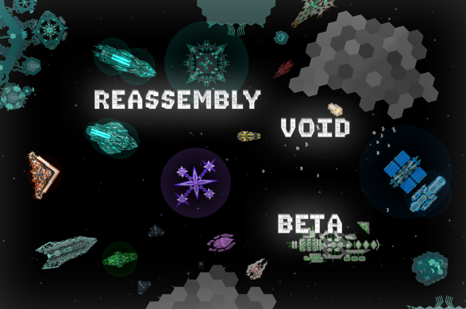

# RST-重组-虚空
## <font face="blocks5"><font color=#7AA9CC>Reassembly-RST-Void</font></font>
<font color=#7AA9CC>An REA *(Reassembly)* mod made by my self</font>
## 前言
### <font color=#CC3333>**警告：该种族并没有完善英文翻译，所有在 blocks 文件夹内的 .lua 文件出现的方块若有中文名称，都需要改成英文，并且目前已修改的英文几乎是通过机翻翻译的。**</font>
<font color=#AA1111>TEXT</font>  
这个mod主要是用于生涯，以及娱乐，并不属于外貌型或强度型 mod。由于刚刚做出这个 mod 时我还是个萌新，会有很多需要改进的地方，我会在以后慢慢地补充。  
Text
## 内容简介  
### Text
RST-重组-虚空是一个多种族的长期更新的游戏 mod，基于游戏 Reassembly 制作，由于该游戏制作mod极为简单，所以可以在 README 中就写下游戏 mod 一些零件或者种族的制作方法~  
Text

### 模组目前(截至2023/06/30)有这些内容：  
Text  
### 首先是预览图：  
Text

  
(由于预览图一般是在游戏里当一个较小的图标使用，所以压缩了大小)  
Text
### 接下来是游戏的种族列表：  
Text
| **Ident** 	|                 **Name**                	|     **Playable**     	|      **Start**      	| **Primaries** 	| **Color0** 	| **Color1** 	| **Color2** 	|                                                    **AI flags**                                                   	| **Thrust SFX** 	| **Explosion Color0** 	| **Explosion Color1** 	|
|:---------:	|:---------------------------------------:	|:--------------------:	|:-------------------:	|:-------------:	|:----------:	|:----------:	|:----------:	|:-----------------------------------------------------------------------------------------------------------------:	|:--------------:	|:--------------------:	|:--------------------:	|
|   17904   	|                  Fungi                  	| Always Unlockable(2) 	|      17904_战菌     	|       0       	|      /     	|      /     	|      /     	|        AGGRESSIVE\|CAUTIOUS\|DODGES\|FLOCKING\|FORGIVING\|PEACEFUL\|SMART_FIRE\|SOCIAL\|SPREAD_FIRE\|WANDER       	|      False     	|       <font color=#bdc7c3>0xbdc7c3</font>       	|       <font color=#677c74>0x677c74</font>       	|
|   17905   	|                  Legion                 	| Always Unlockable(2) 	|    17905_萨蒂安I    	|       2       	|  <font color=#5fead1>0x5fead1</font>  	|  <font color=#393a3a>0x393a3a</font>  	|      /     	|                       BAD_AIM\|FLOCKING\|FORGIVING\|METAMORPHOSIS\|RECKLESS\|SOCIAL\|WANDER                       	|      False     	|           /          	|           /          	|
|   17902   	| Human interstellar United Nations(HIUN) 	| Always Unlockable(2) 	|    17902_镧侦查机   	|       3       	|  <font color=#767676>0x767676</font>  	|  <font color=#00d6ff>0x00d6ff</font>  	|  <font color=#2e2e2e>0x2e2e2e</font> 	|                             BAD_AIM\|CAUTIOUS\|FLOCKING\|PEACEFUL\|SMART_FIRE\|WANDER                             	|      False     	|           /          	|           /          	|
|   17907   	|            Shadow of the Void           	| Always Unlockable(2) 	|  17907_^6虚空毁灭者 	|       3       	|  <font color=#3e3e3e>0x3e3e3e</font>  	|  <font color=#75677c>0x75677c</font>  	|  <font color=#d14fed>0xd14fed  	|                                  BAD_AIM\|CAUTIOUS\|PEACEFUL\|SMART_FIRE\|WANDER                                  	|      True      	|           /          	|           /          	|
|   17901   	|                   ICE                   	|    Not playable(0)   	|          /          	|       2       	|  <font color=#787d92>0x787d92</font>  	|  <font color=#9db5c5>0x9db5c5</font>  	|      /     	|                      CAUTIOUS\|FORGIVING\|HATES_PLANTS\|PEACEFUL\|SMART_FIRE\|SOCIAL\|WANDER                      	|      False     	|       <font color=#c1f7ff>0xc1f7ff</font>       	|       <font color=#f8feff>0xf8feff</font>       	|
|   17910   	|                  Ghost                  	|    Not playable(0)   	|          /          	|       2       	|  <font color=#656565>0x656565</font>  	|  <font color=#c5c5c5>0xc5c5c5</font>  	|      /     	|                                 CAUTIOUS\|DODGES\|FORGIVING\|METAMORPHOSIS\|WANDER                                	|      False     	|           /          	|           /          	|
|   17912   	|                Admantite                	|    Not playable(0)   	|          /          	|       2       	|  <font color=#d47351>0xd47351</font>  	|  <font color=#999999>0x999999</font>  	|      /     	|                      AGGRESSIVE\|FLOCKING\|FORGIVING\|METAMORPHOSIS\|RECKLESS\|SOCIAL\|WANDER                     	|      False     	|           /          	|           /          	|
|   17914   	|                  Terra                  	| Always Unlockable(2) 	| 17914_^6守护者-火种 	|       3       	|  <font color=#4b220d>0x4b220d</font>  	|  <font color=#17c47c>0x17c47c </font> 	|  <font color=#7e8a87>0x7e8a87</font>  	|          CAUTIOUS\|DODGES\|FLOCKING\|FORGIVING\|METAMORPHOSIS\|PEACEFUL\|RIPPLE_FIRE\|SMART_FIRE\|WANDER          	|      False     	|           /          	|           /          	|
|   17906   	|               Revitalizer               	| Always Unlockable(2) 	|     17906_拾光者    	|       2       	|  <font color=#e17411>0xe17411</font>  	|  <font color=#b3b3b3>0xb3b3b3</font>  	|      /     	|                      CAUTIOUS\|DODGES\|FLOCKING\|PEACEFUL\|SOCIAL\|TRACTOR_TRANSIENT\|WANDER                      	|      False     	|           /          	|           /          	|
|   17915   	|                Backbones                	| Always Unlockable(2) 	| 17915_“锥”战机EXTRA 	|       3       	|  <font color=#696969>0x696969</font>  	|  <font color=#02a300>0x02a300</font>  	|  <font color=#bbbbbb>0xbbbbbb</font>   	|                                    CAUTIOUS\|DODGES\|FLOCKING\|PEACEFUL\|WANDER                                   	|      False     	|       <font color=#ff7000>0xff7000       	|       <font color=#c5f3fd>0xc5f3fd       	|
|   17916   	|                FXTY100101               	| Always Unlockable(2) 	|   17916_^2MILK系统  	|       2       	|  <font color=#5a9085>0x5a9085</font>  	|  <font color=#0a8d12>0x0a8d12</font>  	|      /     	|                 AGGRESSIVE\|FLOCKING\|FORGIVING\|HATES_PLANTS\|METAMORPHOSIS\|SPREAD_FIRE\|WANDER                 	|      False     	|       <font color=#84ff67>0x84ff67       	|       <font color=#dcffd4>0xdcffd4       	|
|   17922   	|          Ectoplasm Lairdweller          	| Always Unlockable(2) 	| 17922_^4巢雏-碎片^7 	|       3       	|  <font color=#0098ff>0x0098ff</font>  	|  <font color=#1f1f1f>0x1f1f1f</font>  	|  <font color=#b40000>0xb40000</font>  	|                  CAUTIOUS\|DODGES\|FORGIVING\|METAMORPHOSIS\|PEACEFUL\|SMART_FIRE\|SOCIAL\|WANDER                 	|      False     	|       <font color=#0077c8>0x0077c8</font>       	|       <font color=#b40000>0xb40000</font>       	|
|   17997   	|       3X-A Hatchery Consciousness       	|    Not playable(0)   	| 17997_X-A星云改装型 	|       3       	|  <font color=#f0f0f0>0xf0f0f0</font>  	|  <font color=#ff7500>0xff7500</font>  	|  <font color=#262626>0x262626</font>  	| AGGRESSIVE\|CAUTIOUS\|FLOCKING\|FORGIVING\|METAMORPHOSIS\|PEACEFUL\|SMART_FIRE\|SOCIAL\|TRACTOR_TRANSIENT\|WANDER 	|      False     	|           /          	|           /          	|
|   179102  	|             ...The Punisher             	|    Not playable(0)   	|          /          	|       1       	|  <font color=#4232c9>0x4232c9</font>   	|      /     	|      /     	|                                                         /                                                         	|      False     	|           /          	|           /          	|
|   179103  	|                 ...00KF                 	|    Not playable(0)   	|          /          	|       1       	|  <font color=#4232c9>0x4232c9</font>   	|      /     	|      /     	|                                                         /                                                         	|      False     	|           /          	|           /          	|
|   179101  	|       Center of the universe......      	|    Not playable(0)   	|          /          	|       1       	|      /     	|      /     	|      /     	|                                                         /                                                         	|      False     	|           /          	|           /          	|
|   17998   	|               Wind Catcher              	| Always Unlockable(2) 	|      17998_丝雀     	|       3       	|  <font color=#ededed>0xededed</font>  	|  <font color=#d696ba>0xd696ba</font>  	|  <font color=#d65799>0xd65799</font>  	|                       DODGES\|FLOCKING\|METAMORPHOSIS\|PEACEFUL\|SMART_FIRE\|SOCIAL\|WANDER                       	|      False     	|       <font color=#e7b1cf>0xe7b1cf</font>       	|       <font color=#ededed>0xededed</font>       	|
|   17919   	|          The Lost Civilization          	| Always Unlockable(2) 	|     Nothing now     	|       3       	|  <font color=#1a285f>0x1a285f</font>  	|  <font color=#2e5969>0x2e5969</font>  	|  <font color=#e0e1ce>0xe0e1ce</font>  	|                            AGGRESSIVE\|CAUTIOUS\|DODGES\|FORGIVING\|SMART_FIRE\|WANDER                            	|      False     	|           /          	|           /          	|

这些数据代表了种族的名称，颜色，性格一类。它们都是会在游戏里用到的信息，如果要知道更加详细（符合 mod 语法）的信息，可以去 factions.lua 查看。

-------------------

## <font color=#DD8822>关于游戏mod制作：</font>  
Text  
Reassembly 官方有出过制作 mod 的教程，链接如下：   
Text  
### [ **Reassembly docs** ](http://www.anisopteragames.com/docs/ "Docs|REASSEMBLY")

## 游戏语法
Text

Reassembly 的 mod 语法很简单，因为官方已经给了我们很多模板，通过官方的预设即可做出比较丰富的 mod。  
Text  
blocks.lua 中使用`{}`分隔每一个零件或零件内的参数，这边我会使用我的 mod 里一件武器的 blocks 代码进行演示。
```lua
{
    1010163,                                    --ident
    group=17916,                                --group (The faction to which they belong)
    features=PALETTE|CANNON|TURRET,             --block features
    name="火炮模块",                             
    blurb="高伤害火炮模块",                   
    shape=SQUARE_LAUNCHER,                      
    scale=1,                                    --shape scale
    fillColor=0x66102e1d,                       
    fillColor1=0x065d24,                    
    lineColor=0x5cbb5b,                     
    durability=3,                               --durability * block's area = Health
    density=0.12,                               --density * block's area = weight
    growRate=5,                                 --Assembly rate                  
    shroud={                                    --shroud (You can think of it as an ornament)
        {size={6,3},offset={-1, 0, 0.33},taper=1,count=1,angle=0,tri_color_id=0,tri_color1_id=1,line_color_id=2,shape=SQUARE}
        {size={4,1.25},offset={-1, 2.5, 0.32},taper=1,count=1,angle=0,tri_color_id=0,tri_color1_id=1,line_color_id=2,shape=SQUARE}
        {size={4,0.75},offset={2, 1.5, 0.31},taper=1,count=1,angle=0,tri_color_id=0,tri_color1_id=1,line_color_id=2,shape=SQUARE}
        {size={4,0.75},offset={2, -1.5, 0.31},taper=1,count=1,angle=0,tri_color_id=0,tri_color1_id=1,line_color_id=2,shape=SQUARE}
        {size={4,2.5},offset={-2.5, 0, 0.31},taper=1,count=1,angle=0,tri_color_id=0,tri_color1_id=1,line_color_id=2,shape=SQUARE}
        {size={4,1.25},offset={-1, -2.5, 0.32},taper=1,count=1,angle=0,tri_color_id=0,tri_color1_id=1,line_color_id=2,shape=SQUARE}
        {size={7.5,1.25},offset={2.5, 0, 0.3},taper=1,count=1,angle=0,tri_color_id=0,tri_color1_id=1,line_color_id=2,shape=SQUARE}
        {size={4.242,2.121},offset={0.5, -1.5, 0.33},taper=1,count=1,angle=0.785,tri_color_id=0,tri_color1_id=1,line_color_id=2,shape=SQUARE}
        }
    bindingId=1,                                --Weapon group Id
    capacity=0,                                 --R capacity
    cannon={                                    --Parameters for features = CANNON
        damage=60,                              --Damage per hit
        power=10,                               --Power per shot
        roundsPerSec=5,
        muzzleVel=1200,                         --Bullet velocity
        range=1300,
        spread=0,                               --Spread (± radian)
        roundsPerBurst=5,
        burstyness=0.8,                         --The proportion of the cannon's rest time in a burst.
        color=0x5bbb80,                         --Bullet's color!
        explosive=FRAG_FINAL,                   --Explosive properties of the bullet
        fragment={
            roundsPerBurst=4,                   --Number of bullets in the fragment
            muzzleVel=200,
            spread=2.356,
            pattern=SPIRAL|ABSOLUTE,            --Special parameters of fragment
            damage=60,
            range=80,
            color=0x5bbb80,                     --Also bullet's color!
        }
    },
    turretSpeed=7,                              --Rotating speed (radian/s)
},
```
这段代码展示了 <font color=#0a8d12>FXTY100101</font> 种族的火炮模块， 其中除了方块的基础参数外还有通过 <font color=#DD8833>features</font> 添加的特殊参数。  
Text  
所有 blocks 参数的作用均可在 Reassembly 文档内找到，防止文档过长就不写啦。  
Text  

### 自定义形状制作
我也和先前一样通过一段代码来展示自定义形状制作的方法。  
Text
```lua
--HEXAGON_THRUSTER
	{
        1792125103, --ident
        {
            {   --shape data
                verts={{-2.598,-3},{-2.598,3},{0,1.5},{0,-1.5}},    --coordinates of the end points
                --         ↓The port is at the 50% position of side A→B
                ports={{2,0.5,THRUSTER_IN},{0,0.5,}}, 
                --      ↑ The side where the port is (from 0)
            }       --scale 1
	        {
                verts={{-5.196,-6},{-5.196,6},{0,3},{0,-3}},         --  ↓port property
                ports={{2,0.25,THRUSTER_IN},{2,0.5,THRUSTER_IN},{2,0.75,THRUSTER_IN},{0,0.5,}}
            }       --scale 2
	        {
                verts={{-7.794,-9},{-7.794,9},{0,4.5},{0,-4.5}},
                ports={{2,0.167,THRUSTER_IN},{2,0.5,THRUSTER_IN},{2,0.875,THRUSTER_IN},{0,0.5,},}
            }       --scale 3
	        {
                verts={{-10.392,-12},{-10.392,12},{0,6},{0,-6}},
                ports={{2,0.125,THRUSTER_IN},{2,0.5,THRUSTER_IN},{2,0.375,THRUSTER_IN},{2,0.625,THRUSTER_IN},{2,0.875,THRUSTER_IN},{0,0.5,}}
            }       --scale 4
        },
	}
```
### <font color = #CC4444>注意：自定义形状的端点从第一个端点开始往后进行渲染，需要以顺时针方向按顺序写出各端点的坐标，不出现凹形状，并且小于 32 个端点时，游戏才能正确地渲染出这个形状（原版的 CANNON2 形状虽然是凹的但是渲染没有问题，原因是游戏使用了另一种渲染方式）。</font>
<font color = #AA3333>TEXT</font>  

游戏内长度单位为：1单位 = 1/10 SQUARE (scale1) 形状长度（也就是原版1x1大小的基础方块的长度）  
Text  
创建对称自定义形状时最好保证对称轴为X轴，否则非常容易出现框选镜像时零件断开的情况（不保证对称也有解决办法，就是制作一个镜像的形状并且在blocks里加上镜像的形状）  
Text  
游戏内形状计算精准度为小数点后六位。  
Text  
下面是接点的属性：  
Text  
|   **Name**   	|          **Effect**          	|
|:------------:	|:----------------------------:	|
|     NONE     	|          Normal port         	|
|  THRUSTER_IN 	|   Thruster Connection Port   	|
| THRUSTER_OUT 	|        Thruster Output       	|
|   WEAPON_IN  	|    Weapon Connection Port    	|
|  WEAPON_OUT  	|         Weapon Output        	|
|    MISSILE   	|    Missile Connection Port   	|
|   LAUNCHER   	|         Missile Mount        	|
|     ROOT     	| ROOT ENVIRONMENTAL connector 	|

如果需要镜像形状，可以使用：  
Text  
```lua
{
    103, --ident
    {},
    mirror_of=102 --ident
},
```
来直接对一个形状进行镜像。  
Text  